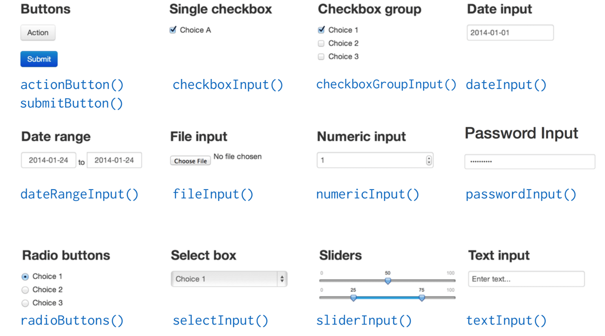
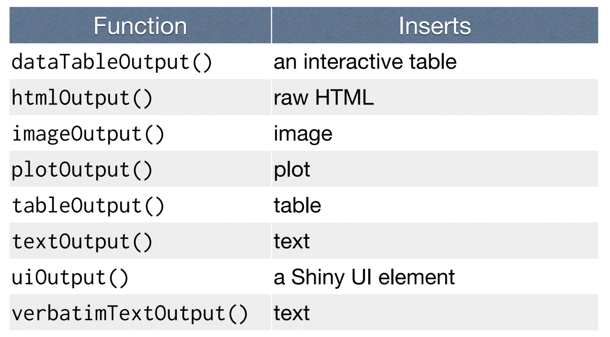
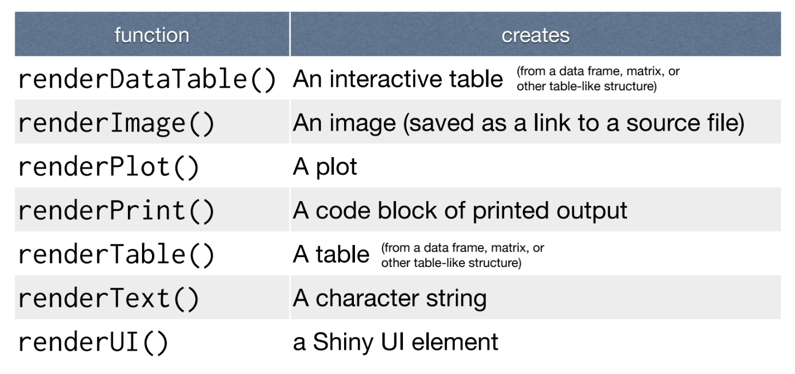
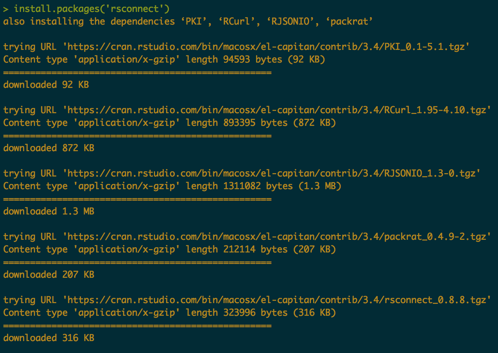
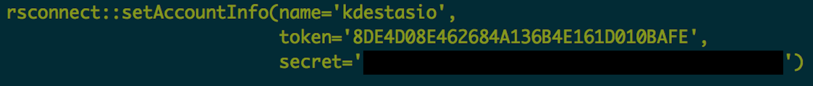
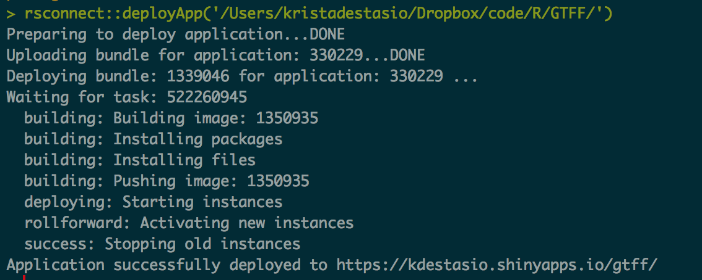

```{r setup, include=FALSE}
setwd('~/Dropbox/code/R/shiny/')
knitr::opts_chunk$set(echo = TRUE)
```

# The basics
[Shiny](https://shiny.rstudio.com/) is an R package that allows you to make interactive web apps.  

There are already a ton of Shiny apps available for exploration on the web. For example, [these power analysis apps.](https://www.showmeshiny.com/category/stats/power/)  


We even have a Shiny app on our GTFF website that lets you calculate the cost and savings of union membership! Check it out here: https://kdestasio.shinyapps.io/gtff/  


# App architecture
The basic components of a functional Shiny app are the server.R and ui.R (user interface) files.   

Every Shiny app is generated by a computer (server) using R. The instructions for the server are typically in the server.R file. The output generated is an HTML web document, the appearance of which is dictated by the ui.R file.  


[Garret Grolemund](https://www.dropbox.com/s/rjt6g3ctdqvihat/shiny-quickstart-1.zip?dl=0&file_subpath=%2Fdownloads%2F01-How-to-start.pdf) has a nice tutorial online, and we will be largely pulling from his content today. Grolemund suggests starting every Shiny app with a basic template.  


```{r}
library(shiny)
ui <- fluidPage() # Set up a ui object
 
server <- function(input, output) {} # Set up a server object
 
shinyApp(ui = ui, server = server) # Knit the ui and server objects together into a shiny app
```

Go ahead and run the code.  

It may not look like anything happened, but you've just created an empty Shiny app that you can use as the foundation for most anything you want.  

# Inputs and Outputs
An app has inputs and outputs. They are put in the fluidPage section of the app.  


```
ui <- fluidPage(
#Input() functions,
#Output() funtions
)
```

```{r}
library(shiny)
ui <- fluidPage("Hello World") 
 
server <- function(input, output) {}
 
shinyApp(ui = ui, server = server) 
```


Inputs are things users can change. Outputs are what they see. In the GTFF calculator, the inputs are all the fields in the left column. They can be adjusted by the user and their values change the output, seen in the right panel of the window.  

## Inputs

There are several different input types to choose from:  

  
Below is some code to make a slider.  

```{r}
library(shiny)
ui <- fluidPage(sliderInput(inputId = "num", # for internal use
            label = "Choose a number", # what the user sees
            value = 25, min = 1, max = 100)) # values to use in your slider
 
server <- function(input, output) {} 
 
shinyApp(ui = ui, server = server) 
```

## Outputs



```
plotOutput(outputId = "hist")

# plotOutput is the type of output
# hist is the internal label
```
```{r}
library(shiny)
ui <- fluidPage(sliderInput(inputId = "num", # for internal use
            label = "Choose a number", # what the user sees
            value = 25, min = 1, max = 100), # values to use in your slider
            plotOutput("hist") # tells the app to make space for output
            ) 
 
server <- function(input, output) {} 
 
shinyApp(ui = ui, server = server) 
```

# Server function
**Rules**
1. When using the server function, save output objects to output$
````
server <- function(input, output){
    output$hist <- renderPlot({

    })
}
```

2. Buils objects with `render*()`  




3. Use inut values with input$

Here's a simple example using what we've learned so far:  
```{r}
library(shiny)

ui <- fluidPage(
    sliderInput(inputId = "num",
                label = "Choose a number",
                value = 25, min = 1, max = 100),
    plotOutput("hist")
)

server <- function(input, output) {
    output$hist <- renderPlot({
        hist(rnorm(input$num))
    })
}

shinyApp(ui = ui, server = server)
```

Looking at the GTFF calculator, we can see that, though there's more going on, we are following the same basic ideas we just covered. For that app though, because there's more code, the server instructions and ui components are saved to separate files. The files are named by the required convention `server.R` and `ui.R`  


# Hosting Shiny Apps
`Shinyapps.io` is a free server maintained by RStudio. It's pretty straight forward and a good way to start.  






# Show Me Shiny
There's an entire [gallery of Shiny Apps](https://www.showmeshiny.com/) with available code to explore. Go ahead and find one that's interesting to you. Then you can download it and play around with changing the code to see what happens.  

# Links
[Get started with shiny with these R webinars](https://vimeo.com/rstudioinc/review/131218530/212d8a5a7a/#t=0m0s) and get the [slides and code here](https://shiny.rstudio.com/tutorial/)
[Rblogger tutorial](https://www.r-bloggers.com/building-shiny-apps-an-interactive-tutorial/)
[Datacamp Shiny Lessons](https://www.datacamp.com/courses/building-web-applications-in-r-with-shiny)
[RStudio Shiny tutorial](RStudio Shiny tutorial)
